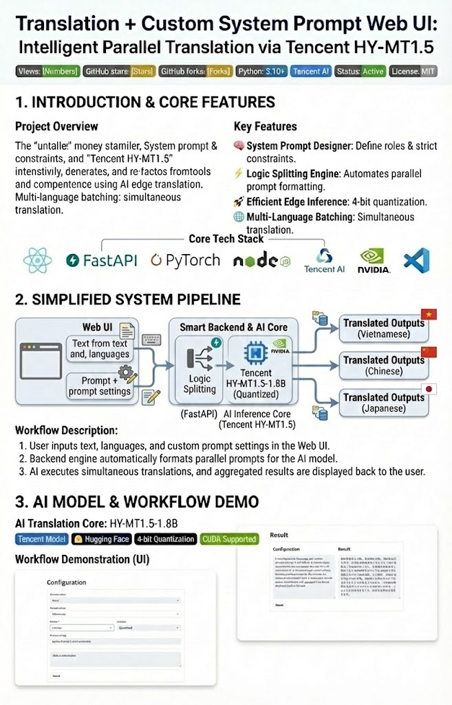
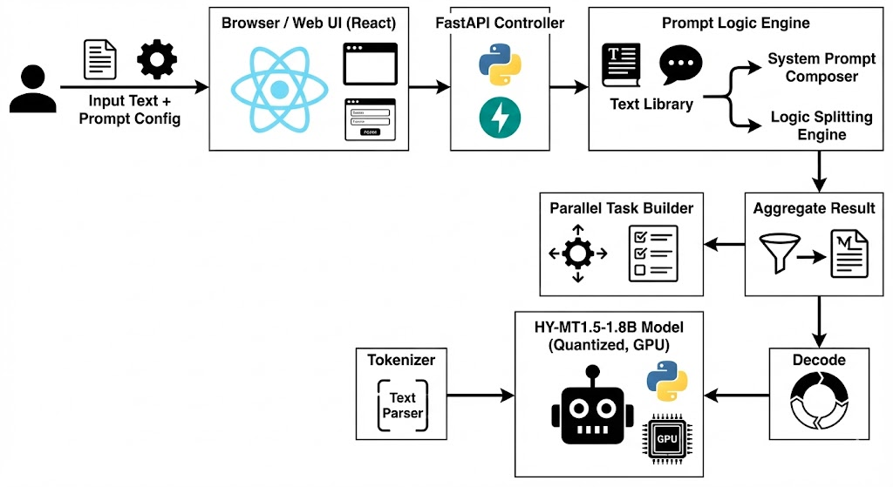
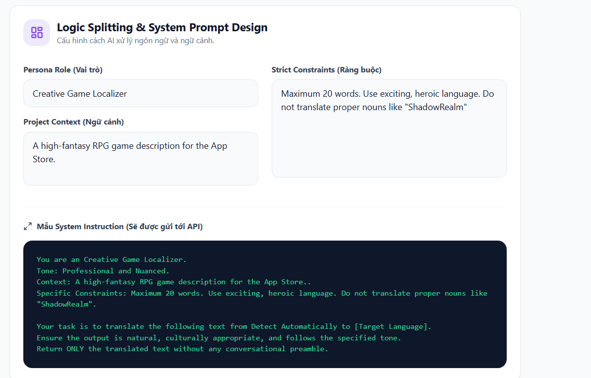
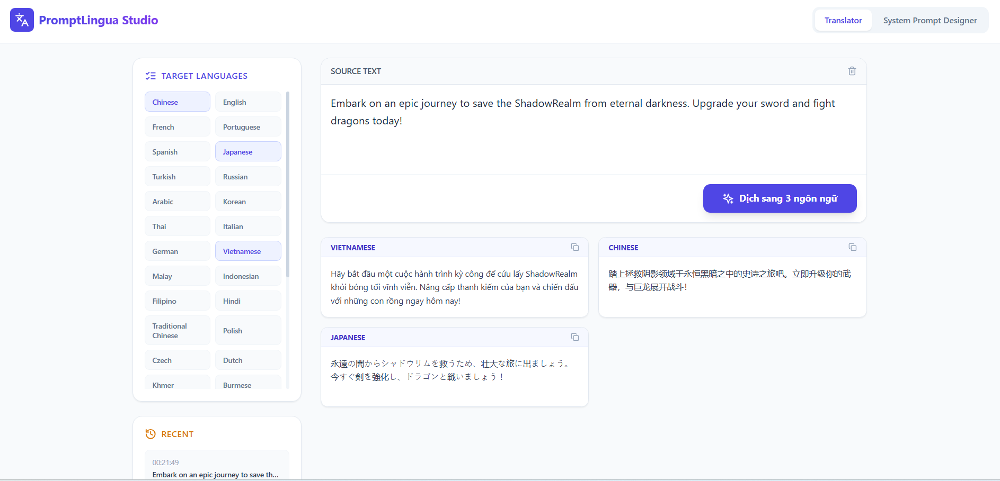

# 🌐 Translation + Custom System Prompt Web UI

> **Intelligent parallel translation powered by Tencent HY-MT1.5-1.8B & Custom System Prompts.**
> The project provides a lightweight web interface and backend for text translation with extensive System Prompt customization capabilities.

<div align="center">

### Powered by Tencent HY-MT1.5-1.8B with Custom System Prompt



<p><i>Lightweight Web UI for Parallel Translation with Custom System Prompt Design</i></p>

</div>

<div align="center">


[](https://github.com/Kietnehi/Translation_Generation/stargazers)
[](https://github.com/Kietnehi/Translation_Generation/network/members)


[](https://github.com/Kietnehi)
[](https://github.com/Kietnehi)


---


## 🔁 System Pipeline & Architecture

This diagram illustrates the end-to-end workflow of the **Translation + Custom System Prompt Web UI**, from user input to parallel multilingual output.

<p align="center">
  
</p>

## Features

- Translate text into multiple target languages.
- Set a custom system prompt to influence translation behavior.
- Lightweight web interface for easy testing.
- Uses 4-bit quantized model for efficient GPU usage.

---

## 🌟 Features

- **Multi-Language Support**: Translate text into multiple target languages simultaneously.
- **System Prompt Designer**: Influence translation behavior by setting Persona, Context, and Strict Constraints.
- **Logic Splitting**: Automatically formats instructions for the AI, replacing `[Target Language]` dynamically for each task.
- **Efficient Inference**: Uses 4-bit quantization (`bitsandbytes`) for optimized GPU usage.
- **History Tracking**: Keep track of recent translation requests and configurations.

---

## 📸 Screenshots & Workflow Analysis

Below is a practical illustration of how the system handles intelligent translation logic:

### 1. System Prompt Designer (Logic Configuration)
Where the "brain" is set up for the AI before executing the task.

<p align="center">
  
</p>

* **Persona & Context**: Setting up the role of "Creative Game Localizer" helps the AI choose words with nuances suitable for the Fantasy genre instead of rigid machine translation.
* **Constraint Enforcement**: Applying strict constraints such as "Do not translate proper nouns" (ShadowRealm) to protect the content's identity.

### 2. Intelligent Translator (Execution & Results)
AI performs parallel translation based on the established instructions.

<p align="center">
  
</p>

* **Analysis**: The model strictly adheres to system commands — keeping the word "ShadowRealm" unchanged in Vietnamese, Chinese, and Japanese translations.
* **Optimization**: Intuitive card interface supports quick copying of each language, helping to increase work efficiency.

---

### 🌟 Advanced Features (New!)

- **Logic Splitting Engine**: Automates the splitting of system logic. You only need to set up the template once, the system will automatically adjust the content for each target language by replacing the `[Target Language]` variable in real time.
- **System Prompt Designer**: In-depth Prompt design interface with:
  - **Persona Role**: Define the translation style (Expert, Creative, Technical).
  - **Project Context**: Provide context for the AI to deeply understand the content to be translated.
  - **Strict Constraints**: Set "hard" rules (maintain original length, do not translate technical terms, preserve Code formatting).
- **Real-time Instruction Preview**: Preview the system command chain that will be sent to the HY-MT1.5 model before translation.
- **Multi-Language Batch Processing**: Translate multiple languages in parallel with separate system instructions for each stream.

---

## Quick Start

### 1. Frontend Setup

```bash
npm install
npm run dev
```

This will start the frontend development server.

### 2. Backend Setup

1. Create a Python virtual environment and activate it:

```bash
python -m venv venv
source venv/bin/activate  # Linux/Mac
venv\Scripts\activate     # Windows
```

2. Install Python dependencies:

```bash
pip install -r requirements.txt
```

3. Run the FastAPI app:

```bash
python app.py
```

4. Open your browser at [http://localhost:8000](http://localhost:8000) and use the form to:

- Enter input text
- Optionally provide a custom system prompt
- Select target language(s)

---

### 3. Using Prompt Designer
- Switch to the **System Prompt Designer** tab.
- Fill in the parameters: Role, Context, and Constraints.
- Return to the **Translator** tab, enter the text and press **"Translate"**. The system will automatically combine these parameters into the system command sent to the AI.

---
## Notes

- Model weights are loaded with **4-bit quantization**. Make sure:
  - Your environment supports `bitsandbytes`
  - You have a compatible GPU
- The server currently runs inference synchronously in a thread pool.  
  For production, consider **batching requests** or using an **async queue** for better throughput.

---

## Dependencies

- Python >= 3.10
- FastAPI
- Uvicorn
- bitsandbytes
- `tencent/HY-MT1.5-1.8B` model from Hugging Face
- Node.js & npm for frontend

---

# HY-MT1.5-1.8B - Hunyuan Translation Model v1.5 (1.8B)

## Overview
HY-MT1.5-1.8B is a 1.8 billion parameter translation model from Tencent's Hunyuan Translation Model v1.5 series. It is designed for high-quality, real-time translations across 33 languages and 5 ethnic/dialect variations. Despite being smaller than the 7B version, it achieves comparable performance while being optimized for edge device deployment.

## Key Features
- **High Performance**: Industry-leading results for models of similar size, surpassing most commercial translation APIs.
- **Edge Deployment**: Quantized versions allow real-time translation on edge devices.
- **Advanced Translation Capabilities**:
  - Terminology intervention
  - Contextual translation
  - Formatted translation
  - Mixed-language scenario support
- **Lightweight & Fast**: Delivers high-speed inference without significant loss in translation quality.

## Model Variants
| Model | Description |
|-------|-------------|
| `HY-MT1.5-1.8B` | Standard 1.8B translation model |
| `HY-MT1.5-1.8B-FP8` | FP8 quantized model for faster deployment |
| `HY-MT1.5-1.8B-GPTQ-Int4` | INT4 quantized model for edge devices |
| `HY-MT1.5-7B` | Larger 7B model, upgraded for mixed-language and annotated translation |
| `HY-MT1.5-7B-FP8` | FP8 quantized 7B model |
| `HY-MT1.5-7B-GPTQ-Int4` | INT4 quantized 7B model |

## Supported Languages
- Chinese (zh), English (en), French (fr), Portuguese (pt), Spanish (es)
- Japanese (ja), Turkish (tr), Russian (ru), Arabic (ar), Korean (ko)
- Thai (th), Italian (it), German (de), Vietnamese (vi), Malay (ms)
- Indonesian (id), Filipino (tl), Hindi (hi), Traditional Chinese (zh-Hant)
- Polish (pl), Czech (cs), Dutch (nl), Khmer (km), Burmese (my)
- Persian (fa), Gujarati (gu), Urdu (ur), Telugu (te), Marathi (mr)
- Hebrew (he), Bengali (bn), Tamil (ta), Ukrainian (uk), Tibetan (bo)
- Kazakh (kk), Mongolian (mn), Uyghur (ug), Cantonese (yue)

## Quick Start with Transformers
```python
from transformers import AutoModelForCausalLM, AutoTokenizer

model_name_or_path = "tencent/HY-MT1.5-1.8B"

tokenizer = AutoTokenizer.from_pretrained(model_name_or_path)
model = AutoModelForCausalLM.from_pretrained(model_name_or_path, device_map="auto")

messages = [
    {"role": "user", "content": "Translate the following segment into Chinese, without additional explanation.\n\nIt’s on the house."},
]

tokenized_chat = tokenizer.apply_chat_template(
    messages,
    tokenize=True,
    add_generation_prompt=False,
    return_tensors="pt"
)

outputs = model.generate(tokenized_chat.to(model.device), max_new_tokens=2048)
output_text = tokenizer.decode(outputs[0])
print(output_text)
```

### Recommended Inference Parameters
```json
{
  "top_k": 20,
  "top_p": 0.6,
  "repetition_penalty": 1.05,
  "temperature": 0.7
}
```

---
## License

Specify your license here (MIT/Apache/Proprietary).

## 🔗 Author's GitHub

<div align="center">


<p align="center">
  <a href="https://github.com/Kietnehi">
    
  </a>
</p>

<h3>🚀 Truong Phu Kiet</h3>

<a href="https://github.com/Kietnehi">
  
</a>


<br/><br/>

<p align="center">
  
  
</p>

<h3>🛠 Tech Stack</h3>
<p align="center">
  <a href="https://skillicons.dev">
    
  </a>
</p>

<br/>

<h3>🌟 Translation + Text Generation Web Application Using Tencent Model</h3>
<p align="center">
  <a href="https://github.com/Kietnehi/FaceRecognition_WEB">
    
    
    
  </a>
</p>
<!-- Dynamic quote -->
<p align="center">
  
</p>
<p align="center">
  <i>Thank you for visiting! Don't forget to click <b>⭐️ Star</b> to support the project.</i>
</p>


</div>

---
## Citation
```bibtex
@misc{hy-mt1.5,
  title={HY-MT1.5 Technical Report}, 
  author={Mao Zheng and Zheng Li and Tao Chen and Mingyang Song and Di Wang},
  year={2025},
  eprint={2512.24092},
  archivePrefix={arXiv},
  primaryClass={cs.CL},
  url={https://arxiv.org/abs/2512.24092}
}
```